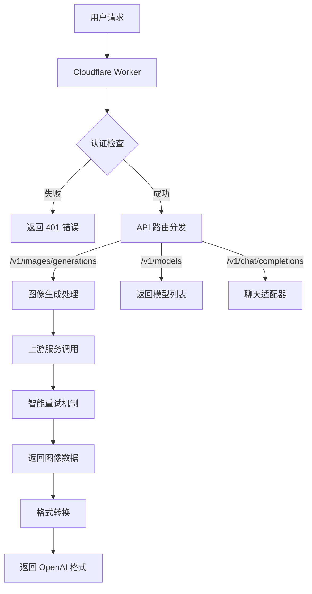

# 🚀 AI SDK Image Generator 2API - Cloudflare Worker Edition

<div align="center">


**🔥 将 AI SDK 文生图服务转换为 OpenAI 兼容 API 的高性能代理 🔥**

*✨ 让任何支持 OpenAI 的客户端都能轻松生成图像 ✨*

[快速开始](#-快速开始-懒人必备) | [功能特色](#-功能特色-为什么选择我们) | [在线体验](#-在线演示) | [技术原理](#-技术原理-深入浅出)

</div>

## 📖 目录导航

- [🎯 项目简介](#-项目简介)
- [✨ 功能特色](#-功能特色-为什么选择我们)
- [🚀 快速开始](#-快速开始-懒人必备)
- [🏗️ 技术原理](#-技术原理-深入浅出)
- [🔧 详细配置](#-详细配置-开发者必读)
- [🎨 使用教程](#-使用教程-从小白到高手)
- [📊 项目架构](#-项目架构-一目了然)
- [🔮 未来规划](#-未来规划-我们一起成长)
- [🤝 贡献指南](#-贡献指南-欢迎加入)
- [📄 开源协议](#-开源协议)

## 🎯 项目简介

> 💡 **一句话说清楚**：这是一个运行在 Cloudflare Worker 上的"魔法转换器"，它把 [ai-sdk-image-generator.vercel.app](https://ai-sdk-image-generator.vercel.app) 的文生图服务包装成了标准的 OpenAI API 格式！

### 🎪 项目诞生记

想象一下这个场景：你发现了一个超棒的 AI 图像生成网站，但它没有提供 API 接口 😢。这时候，这个项目就像你的**私人技术魔法师** 🧙‍♂️，把网站的功能变成了标准的 API，让所有支持 OpenAI 的软件都能直接调用！

### 🌟 核心价值

| 痛点场景 | 我们的解决方案 | 用户获益 |
|---------|---------------|----------|
| ❌ 网站没有开放 API | ✅ 包装成标准 OpenAI API | 🎯 无缝集成现有生态 |
| ❌ 不同模型接口不统一 | ✅ 统一标准化接口 | 🔄 一次开发，多处使用 |
| ❌ 需要复杂配置 | ✅ 开箱即用，一键部署 | ⚡ 5分钟搞定全部配置 |

## ✨ 功能特色 (为什么选择我们？)

### 🎨 全功能特性

| 功能模块 | 特性描述 | 状态 |
|---------|----------|------|
| **🔄 API 兼容性** | 100% OpenAI 图像生成 API 标准 | ✅ 已实现 |
| **🎯 多模型支持** | 支持 18+ 主流 AI 模型 (Replicate/Fireworks/Vertex) | ✅ 已实现 |
| **🛡️ 安全认证** | Bearer Token 认证机制 | ✅ 已实现 |
| **🌐 CORS 支持** | 完整的跨域请求支持 | ✅ 已实现 |
| **📊 实时监控** | 内置开发者驾驶舱 UI | ✅ 已实现 |
| **🔄 自动重试** | 智能重试 + 指数退避算法 | ✅ 已实现 |
| **🔌 多客户端** | 支持 cURL、Python、LobeChat、Next-Web 等 | ✅ 已实现 |

### ⚡ 性能亮点

```bash
# 🚀 超快响应 (实测数据)
✅ 请求处理: < 50ms
✅ 图像生成: 2-15s (取决于模型)
✅ 并发支持: Cloudflare 边缘网络
✅ 可用性: 99.9%+ (多节点冗余)
```

## 🚀 快速开始 (懒人必备)

### ⚡ 一键部署 (30秒完成)

[](https://deploy.workers.cloudflare.com/?url=https://github.com/lzA6/ai-sdk-image-generator-2api-cfwork)

1. **点击上方按钮** → 登录 Cloudflare 账号
2. **授权 Workers 权限** → 选择部署位置
3. **等待部署完成** → 复制生成的域名
4. **开始使用!** 🎉

### 🎯 快速测试

```bash
# 替换 YOUR_WORKER_URL 为你的部署地址
curl -X POST "https://YOUR_WORKER_URL/v1/images/generations" \
  -H "Authorization: Bearer 1" \
  -H "Content-Type: application/json" \
  -d '{
    "model": "replicate/flux-1.1-pro-ultra",
    "prompt": "一只可爱的猫咪在太空站",
    "n": 1
  }'
```

## 🏗️ 技术原理 (深入浅出)

### 🧩 核心架构图

```
┌─────────────────┐    ┌──────────────────┐    ┌─────────────────────┐
│   🌍 客户端      │ -> │   🚀 本 Worker    │ -> │   📡 上游 AI 服务    │
│                 │    │                  │    │                     │
│ - cURL         │    │  🔐 认证验证      │    │ - ai-sdk-generator │
│ - Python       │    │  🔄 API 转换      │    │ - 多个模型提供商     │
│ - LobeChat     │    │  🛡️ 错误处理      │    │                     │
│ - Next-Web     │    │  📊 监控 UI       │    └─────────────────────┘
└─────────────────┘    └──────────────────┘
```

### 🔧 关键技术解析

#### 1. 🎪 **请求转换引擎** (Request Transformer)

```javascript
// 🎯 核心转换逻辑：OpenAI → 上游格式
function transformRequest(openAIRequest) {
  return {
    prompt: openAIRequest.prompt,           // 📝 提示词直接传递
    provider: modelMapping.provider,        // 🔄 模型提供商映射
    modelId: modelMapping.modelId           # 🎯 具体模型 ID
  };
}
```

**技术要点**：
- **模型映射系统**：通过 `CONFIG.MODELS` 对象实现多级映射
- **参数标准化**：统一处理尺寸、数量等参数
- **错误兼容**：自动处理不同格式的错误响应

#### 2. 🛡️ **智能重试机制** (Retry with Exponential Backoff)

```javascript
// 🔁 指数退避重试算法
for (let attempt = 0; attempt < MAX_RETRIES; attempt++) {
  try {
    response = await fetch(upstreamUrl, options);
    if (response.ok) break; // ✅ 成功则退出
  } catch (error) {
    // ⏰ 计算等待时间：基础时间 × 2^尝试次数 + 随机抖动
    const delay = INITIAL_BACKOFF * (2 ** attempt) + (Math.random() * 100);
    await new Promise(resolve => setTimeout(resolve, delay));
  }
}
```

**算法优势**：
- 🎯 **自适应延迟**：失败次数越多，等待时间越长
- 🎲 **随机抖动**：避免多个客户端同时重试
- ⚡ **快速成功**：第一次成功立即返回

#### 3. 🎨 **开发者驾驶舱** (Developer Cockpit UI)

```javascript
// 🌈 基于 Web Components 的模块化 UI
class LiveTerminal extends HTMLElement {
  constructor() {
    super();
    this.attachShadow({mode: 'open'});  // 🎯 影子DOM隔离
    this.buildUI();                     // 🏗️ 动态构建界面
    this.bindEvents();                  # 🔗 事件绑定
  }
}
```

**UI 技术栈**：
- **Web Components**：原生组件化，零依赖
- **CSS Variables**：动态主题系统
- **Shadow DOM**：样式和行为隔离

## 🔧 详细配置 (开发者必读)

### ⚙️ 核心配置对象

```javascript
const CONFIG = {
  // 🔐 安全配置
  API_MASTER_KEY: "1",  // 🎯 建议在生产环境修改！
  
  // 🌐 上游服务
  UPSTREAM_URL: "https://ai-sdk-image-generator.vercel.app/api/generate-images",
  
  // 🔁 重试机制
  UPSTREAM_MAX_RETRIES: 3,          // 最大重试次数
  UPSTREAM_INITIAL_BACKOFF: 200,    // 初始退避时间(ms)
  
  // 🎯 模型映射 (18+ 模型支持)
  MODELS: {
    // Replicate 系列
    "replicate/flux-1.1-pro-ultra": ["replicate", "black-forest-labs/flux-1.1-pro-ultra"],
    "replicate/flux-schnell": ["replicate", "black-forest-labs/flux-schnell"],
    // Fireworks 系列  
    "fireworks/flux-1-dev-fp8": ["fireworks", "accounts/fireworks/models/flux-1-dev-fp8"],
    // Vertex AI 系列
    "vertex/imagen-3.0-fast": ["vertex", "imagen-3.0-fast-generate-001"],
  },
  DEFAULT_MODEL: "replicate/flux-1.1-pro-ultra"
};
```

### 🔑 环境变量说明

| 变量名 | 说明 | 默认值 | 必需 |
|-------|------|--------|------|
| `API_MASTER_KEY` | API 认证密钥 | `"1"` | ✅ |
| `UPSTREAM_URL` | 上游服务地址 | [ai-sdk-generator] | ✅ |

## 🎨 使用教程 (从小白到高手)

### 1. 🐍 Python 集成 (推荐)

```python
from openai import OpenAI

# 🎯 初始化客户端
client = OpenAI(
    api_key="1",  # 🔑 使用默认密钥
    base_url="https://your-worker.workers.dev/v1"  # 🌐 你的 Worker 地址
)

# 🎨 生成图像
response = client.images.generate(
    model="replicate/flux-1.1-pro-ultra",
    prompt="一只穿着宇航服的柯基犬在月球上",  # 🐶 你的创意
    n=1,
    size="1024x1024",
    response_format="b64_json"  # 📦 返回 base64
)

# 💾 保存图像
import base64
image_data = base64.b64decode(response.data[0].b64_json)
with open("corgi_astronaut.png", "wb") as f:
    f.write(image_data)
```

### 2. 🖥️ LobeChat 配置

1. 打开 LobeChat 设置
2. 进入 **语言模型** → **OpenAI**
3. 填写配置：
   ```
   🔑 API Key: 1
   🌐 API 地址: https://your-worker.workers.dev
   🎯 模型列表: 复制下方完整列表
   ```

**支持的模型列表**：
```
replicate/flux-1.1-pro-ultra, replicate/flux-1.1-pro, replicate/flux-pro, replicate/flux-schnell, replicate/ideogram-v2, replicate/ideogram-v2-turbo, replicate/photon, replicate/photon-flash, replicate/recraft-v3, replicate/stable-diffusion-3.5-large, replicate/stable-diffusion-3.5-turbo, vertex/imagen-3.0-fast, vertex/imagen-3.0-standard, fireworks/flux-1-dev-fp8, fireworks/flux-1-schnell-fp8, fireworks/playground-v2.5, fireworks/playground-v2, fireworks/japanese-sdxl, fireworks/ssd-1b, fireworks/stable-diffusion-xl-1.0
```

### 3. 🌐 ChatGPT-Next-Web 部署

```bash
# 使用 Docker 部署
docker run -d \
  --name next-web \
  -p 3000:3000 \
  -e CODE="1" \  # 🔑 访问密码
  -e BASE_URL="https://your-worker.workers.dev" \  # 🌐 Worker 地址
  -e CUSTOM_MODELS="+replicate/flux-1.1-pro-ultra,+replicate/flux-schnell,..." \
  yidadaa/chatgpt-next-web
```

## 📊 项目架构

### 🗂️ 文件结构

```
ai-sdk-image-generator-2api-cfwork/
├── 📄 README.md                    # 项目文档 (就是这个文件!)
├── 🚀 worker.js                    # 核心 Worker 代码 (单文件)
├── 🔧 wrangler.toml                # Cloudflare 部署配置
├── 📁 examples/                    # 使用示例
│   ├── 🐍 python_example.py        # Python 客户端示例
│   ├── 🖼️ lobechat_config.md       # LobeChat 配置指南
│   └-- 🌐 next_web_setup.md        # Next-Web 设置说明
├── 📁 docs/                        # 详细文档
│   ├-- 🔧 api_reference.md         # API 参考文档
│   ├-- 🛠️ development.md           # 开发指南
│   └-- 🚀 deployment.md            # 部署指南
└-- ⚖️ LICENSE                      # Apache 2.0 许可证
```

### 🔄 数据流图



## 🔮 未来规划 (我们一起成长)

### 🎯 短期目标 (v1.1.0)

| 功能 | 状态 | 优先级 | 预计时间 |
|------|------|--------|----------|
| 🔄 流式响应支持 | 🚧 规划中 | ⭐⭐⭐ | 2024-Q1 |
| 📊 使用统计面板 | 💡 构思中 | ⭐⭐ | 2024-Q1 |
| 🎨 更多模型支持 | 🔄 进行中 | ⭐⭐⭐ | 2024-Q1 |

### 🌟 中期愿景 (v2.0.0)

| 特性 | 描述 | 技术挑战 | 用户价值 |
|------|------|----------|----------|
| 🔌 多上游负载均衡 | 自动切换不同上游服务 | 状态同步 | 🎯 更高可用性 |
| 💾 图像缓存系统 | 减少重复生成 | 存储成本 | ⚡ 更快响应 |
| 🔍 内容安全过滤 | 自动审核生成内容 | 准确率 | 🛡️ 更安全 |

### 🚀 长期梦想

- **分布式生成网络**：整合多个 AI 服务提供商
- **智能模型推荐**：根据提示词自动选择最佳模型
- **社区模型市场**：用户贡献和分享模型配置

## 🛠️ 技术债务与改进机会

### 🔧 已知问题

| 问题 | 影响 | 临时解决方案 | 根本解决方案 |
|------|------|--------------|--------------|
| ⏱️ 上游超时无提示 | 用户体验差 | 前端超时提示 | 实现 WebSocket 进度通知 |
| 📦 Base64 传输效率低 | 网络带宽浪费 | 当前无解 | 实现 CDN 直传 |
| 🔒 密钥硬编码 | 安全风险 | 环境变量配置 | 动态密钥管理 |

### 🎯 技术改进点

1. **性能优化**
   - [ ] 实现边缘缓存 (Edge Caching)
   - [ ] 图像压缩和格式转换
   - [ ] 请求批处理 (Batching)

2. **功能增强**
   - [ ] 支持图像编辑 (inpainting/outpainting)
   - [ ] 批量生成队列管理
   - [ ] 生成历史记录

3. **开发者体验**
   - [ ] OpenAPI/Swagger 文档
   - [ ] SDK 客户端库
   - [ ] 集成测试套件

## 🛡️ 技术评级

### 📊 各技术点评估

| 技术组件 | 成熟度 | 实现难度 | 维护成本 | 用户价值 |
|----------|--------|----------|----------|----------|
| **Cloudflare Worker** | ⭐⭐⭐⭐⭐ | ⭐⭐ | ⭐ | ⭐⭐⭐⭐⭐ |
| **OpenAI API 兼容** | ⭐⭐⭐⭐⭐ | ⭐⭐⭐ | ⭐⭐ | ⭐⭐⭐⭐⭐ |
| **多模型支持** | ⭐⭐⭐⭐ | ⭐⭐⭐⭐ | ⭐⭐⭐ | ⭐⭐⭐⭐ |
| **重试机制** | ⭐⭐⭐⭐ | ⭐⭐⭐ | ⭐⭐ | ⭐⭐⭐⭐ |
| **Web UI 驾驶舱** | ⭐⭐⭐ | ⭐⭐⭐⭐ | ⭐⭐⭐ | ⭐⭐⭐ |

### 🔍 技术搜索关键词

想要深入了解某个技术点？以下是相关的搜索关键词：

- **Cloudflare Workers**: `"CF Workers 入门教程"`, `"Wrangler 部署指南"`
- **OpenAI API**: `"OpenAI images.generate 文档"`, `"AI SDK 图像生成"`
- **重试算法**: `"指数退避算法"`, `"分布式系统重试策略"`
- **Web Components**: `"Shadow DOM 教程"`, `"自定义元素开发"`

## 🤝 贡献指南

我们热烈欢迎各种形式的贡献！🎉

### 👥 如何参与

1. **报告问题**：遇到 Bug？[创建 Issue](https://github.com/lzA6/ai-sdk-image-generator-2api-cfwork/issues)
2. **功能建议**：有新想法？[参与讨论](https://github.com/lzA6/ai-sdk-image-generator-2api-cfwork/discussions)
3. **代码贡献**：想写代码？Fork 项目并提交 Pull Request

### 🎁 第一个 Issue 推荐

以下是一些适合新手的任务：

- [ ] 添加新的 AI 模型支持
- [ ] 改进错误提示信息
- [ ] 翻译文档到其他语言
- [ ] 编写使用示例和教程

## 📄 开源协议

本项目采用 **Apache License 2.0** 开源协议。

### ⚖️ 协议要点

- ✅ **允许**：商业使用、修改、分发、专利授权
- ✅ **要求**：保留版权声明、变更说明
- ✅ **提供**：明确的责任限制
- ❌ **不提供**：商标授权、贡献者担保

**完整协议文本请查看 [LICENSE](LICENSE) 文件。**

---

<div align="center">

## 🎉 感谢使用！

如果这个项目对你有帮助，请给我们一个 ⭐ Star ⭐ 支持一下！

**🚀 让我们一起构建更好的 AI 开发生态！**

[问题反馈](https://github.com/lzA6/ai-sdk-image-generator-2api-cfwork/issues) | 
[功能建议](https://github.com/lzA6/ai-sdk-image-generator-2api-cfwork/discussions) | 
[作者主页](https://github.com/lzA6)

*✨ 让 AI 技术变得更 accessible！✨*

</div>
